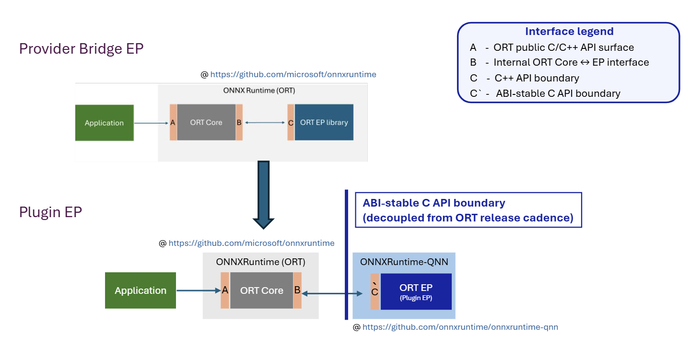
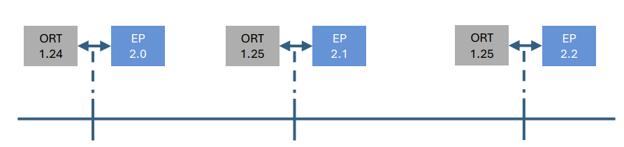

<table align="center" border="0" cellspacing="0" cellpadding="8"><tr valign="middle">
  <td></td>
  <td><h1><big>ONNX RUNTIME QNN Plugin EP</big></h1></td>
</tr></table>

**ONNX Runtime QNN** is a plugin execution provider that brings Qualcomm hardware acceleration to ONNX Runtime — enabling high-performance AI inference on Qualcomm Snapdragon SoCs via the [Qualcomm AI Runtime SDK (QAIRT)](https://qpm.qualcomm.com/#/main/tools/details/Qualcomm_AI_Runtime_SDK).

This repository is maintained by Qualcomm. For the general ONNX Runtime project, visit [microsoft/onnxruntime](https://github.com/microsoft/onnxruntime).

---

## What is a Plugin Execution Provider?

ONNX Runtime supports hardware acceleration through **Execution Providers (EPs)**. The QNN EP is a *plugin* EP — a separately distributed shared library that plugs into a standard ONNX Runtime installation at runtime, without requiring a custom ORT build. [Learn more about Plugin EPs →](https://onnxruntime.ai/docs/execution-providers/plugin-ep-libraries/)

<p align="center"></p>

| | Provider Bridge EP (QNN) | Plugin EP (QNN) |
|---|---|---|
| Distribution | Bundled with ORT | Separate package |
| ORT build required | Yes | No |
| Install | `pip install onnxruntime-qnn` | `pip install onnxruntime-qnn==`**`2.0.0`** |

---

## Install

```bash
pip install onnxruntime
pip install onnxruntime-qnn
```

**Requirements:**
- Windows ARM64 (for on-device inference with Qualcomm NPU)
- Windows X64 (for model quantization and AOT compilation)

For NuGet: [`Qualcomm.ML.OnnxRuntime.QNN`](https://www.nuget.org/packages/Qualcomm.ML.OnnxRuntime.QNN) (Windows ARM64 only)

---

## Resources

| Topic | Link |
|---|---|
| Full documentation | [QNN Execution Provider](docs/execution_providers/QNN-ExecutionProvider.md) |
| Build from source | [Build Guide](docs/execution_providers/build.md) |
| Development guide | [Development Guide](docs/execution_providers/development.md) |

---

## Releases

The current release and past releases can be found here: https://github.com/onnxruntime/onnxruntime-qnn/releases.

<p align="center"></p>

For details on the general ONNX Runtime roadmap, please visit: https://onnxruntime.ai/roadmap.

---

## Contributions and Feedback

We welcome contributions! See the [contribution guidelines](CONTRIBUTING.md).

- Bug reports / feature requests: [GitHub Issues](https://github.com/onnxruntime/onnxruntime-qnn/issues)
- Questions / discussion: [GitHub Discussions](https://github.com/onnxruntime/onnxruntime-qnn/discussions)

## Data/Telemetry

Windows distributions of this project may collect usage data and send it to Microsoft to help improve our products and services. See the [privacy statement](docs/Privacy.md) for more details.

## Code of Conduct

This project has adopted the [Microsoft Open Source Code of Conduct](https://opensource.microsoft.com/codeofconduct/).
For more information see the [Code of Conduct FAQ](https://opensource.microsoft.com/codeofconduct/faq/)
or contact [opencode@microsoft.com](mailto:opencode@microsoft.com) with any additional questions or comments.

## License

This project is licensed under the [MIT License](LICENSE).
