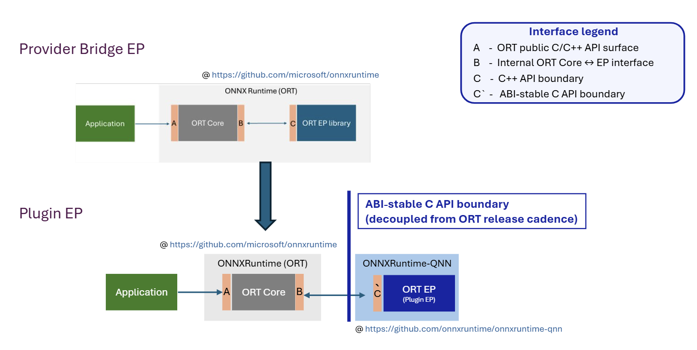

<p align="center"></p>

**ONNX Runtime QNN** is a plugin execution provider that brings Qualcomm hardware acceleration to ONNX Runtime — enabling high-performance AI inference on Qualcomm Snapdragon SoCs via the [Qualcomm AI Runtime SDK (QAIRT)](https://qpm.qualcomm.com/#/main/tools/details/Qualcomm_AI_Runtime_SDK).

This repository is maintained by Qualcomm. For the general ONNX Runtime project, visit [microsoft/onnxruntime](https://github.com/microsoft/onnxruntime).

---

## What is a Plugin Execution Provider?

ONNX Runtime supports hardware acceleration through **Execution Providers (EPs)**. The QNN EP is a *plugin* EP — a separately distributed shared library that plugs into a standard ONNX Runtime installation at runtime, without requiring a custom ORT build.

> **QNN EP 2.2.0 is the Plugin QNN EP.** Starting with version 2.0.0, the QNN EP ships as a standalone plugin package (`onnxruntime-qnn>=2.0.0`) that works with any standard ORT installation — no custom build required. [Learn more about Plugin EPs →](https://onnxruntime.ai/docs/execution-providers/plugin-ep-libraries/)

<br/>
<p align="center"></p>
<br/>

| | Provider Bridge EP (QNN) | Plugin QNN EP |
|---|---|---|
| Distribution | Bundled with ORT | Separate package |
| ORT build required | Yes | No |
| Install | `pip install onnxruntime-qnn==1.x.x` | `pip install onnxruntime-qnn==`**`2.x.x`** |

---

## Getting Started with the Plugin QNN EP

The Plugin QNN EP workflow is different from the classic built-in EP. Follow these steps to migrate or get started.

**1. Client impact: Learn about the ONNX Runtime Plugin EP API →** [Plugin EP Usage](https://onnxruntime.ai/docs/execution-providers/plugin-ep-libraries/usage.html)

**2. Plugin QNN EP specific examples:**

- [C++ example →](docs/execution_providers/QNN-ExecutionProvider.md#c)

- Python example:

```python
import onnxruntime as ort
import onnxruntime_qnn as qnn_ep

# Register QNN EP library
ep_lib_path = qnn_ep.get_library_path()
lib_registration_name = "QNNExecutionProvider"
ort.register_execution_provider_library(lib_registration_name, ep_lib_path)

# Select QNN EP device
all_ep_devices = ort.get_ep_devices()
selected_ep_devices = [ep_device for ep_device in all_ep_devices if ep_device.ep_name == lib_registration_name]

# Configure and create session
ep_options = {'backend_path': qnn_ep.get_qnn_htp_path()}
session_options = ort.SessionOptions()
session_options.add_provider_for_devices(selected_ep_devices, ep_options)
session = ort.InferenceSession("model.onnx", sess_options=session_options)

# Set run options for this specific inference
run_options = ort.RunOptions()
run_options.add_run_config_entry("qnn.perf_mode", "burst")
run_options.add_run_config_entry("qnn.rpc_control_latency", "100")

result = session.run(None, {"input": input_data}, run_options)

# Clean up
del session
ort.unregister_execution_provider_library(lib_registration_name)
```

- [More examples →](docs/execution_providers/QNN-ExecutionProvider.md#qnn-execution-provider)

---

## Install

```bash
pip install onnxruntime==1.24.4
pip install onnxruntime-qnn==2.2.0
```

**Requirements:**
- Windows ARM64 (for on-device inference with Qualcomm NPU)
- Windows X64 (for model quantization and AOT compilation)
- Python 3.11 – 3.14
- Numpy 1.25.2 or >= 1.26.4

For NuGet: [`Qualcomm.ML.OnnxRuntime.QNN`](https://www.nuget.org/packages/Qualcomm.ML.OnnxRuntime.QNN) (Windows ARM64 only)

### Linux Wheels and .tgz Files

- **2.1.1+**: Linux ARM64 Wheels and .tgz files available
- **2.1.0**: Linux ARM64 preview wheels available
- **2.0.0**: No Linux ARM64 Wheels or .tgz files

---

## Resources

| Topic | Link |
|---|---|
| Full documentation | [QNN Execution Provider](docs/execution_providers/QNN-ExecutionProvider.md) |
| Build from source | [Build Guide](docs/execution_providers/build.md) |
| Development guide | [Development Guide](docs/execution_providers/development.md) |

---

## Releases

The current release and past releases can be found here: https://github.com/onnxruntime/onnxruntime-qnn/releases.

For details on the general ONNX Runtime roadmap, please visit: https://onnxruntime.ai/roadmap.

---

## Testing

### Test Architecture

The QNN EP test suite follows a four-tier pyramid:

| Tier | Name | Location | Requires QNN HW? | Guard |
|---|---|---|---|---|
| 1 | **Unit tests** | `test/providers/qnn/unit/` | No | `QNN_EP_FUNCTION_LEVEL_UT=1` |
| 2 | **Integration tests (CPU backend)** | `test/providers/qnn/` | No | — |
| 3 | **Integration tests (HTP backend)** | `test/providers/qnn/` | Yes | — |
| 4 | **End-to-end / model tests** | `test/providers/qnn/` | Yes | — |

Unit tests cover both individual function logic (e.g. utility helpers in `qnn_def.cc`)
and component behavior (e.g. `QnnModelWrapper` end-to-end paths via mocked QNN APIs).
All run on a Linux x86-64 host without QNN hardware.

### Running unit tests (no hardware required)

```bash
# Build with coverage instrumentation (enables QNN_EP_FUNCTION_LEVEL_UT automatically)
python qcom/build_and_test.py --target-py-version 3.12 coverage_linux_x86_64

# Run all QNN unit tests manually
cd build/linux-x86_64/RelWithDebInfo
./onnxruntime_provider_test --gtest_filter="*QnnUnit_*"
```

See [`onnxruntime/test/providers/qnn/unit/README.md`](onnxruntime/test/providers/qnn/unit/README.md) for full details on build flags and coverage workflow.

### Target directory structure (in progress)

```
onnxruntime/test/providers/qnn/
├── unit/                   # Tier 1: pure-logic tests, no QNN SDK calls
│   ├── qnn_def_test.cc
│   ├── qnn_model_wrapper_test.cc
│   └── ...
└── integration/            # Tiers 2–4: require QNN SDK / hardware (planned)
    └── ...
```

---

## Contributions and Feedback

We welcome contributions! See the [contribution guidelines](CONTRIBUTING.md).

- Bug reports / feature requests: [GitHub Issues](https://github.com/onnxruntime/onnxruntime-qnn/issues)
- Questions / discussion: [GitHub Discussions](https://github.com/onnxruntime/onnxruntime-qnn/discussions)

## Data/Telemetry

Windows distributions of this project may collect usage data and send it to Microsoft to help improve our products and services. See the [privacy statement](docs/Privacy.md) for more details.

## Code of Conduct

This project has adopted the [Microsoft Open Source Code of Conduct](https://opensource.microsoft.com/codeofconduct/).
For more information see the [Code of Conduct FAQ](https://opensource.microsoft.com/codeofconduct/faq/)
or contact [opencode@microsoft.com](mailto:opencode@microsoft.com) with any additional questions or comments.

## License

This project is licensed under the [MIT License](LICENSE).
